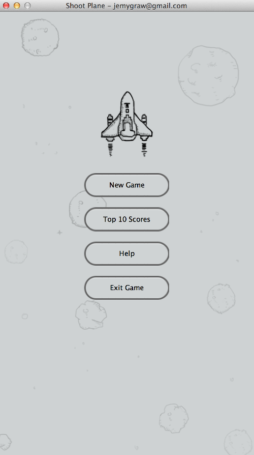
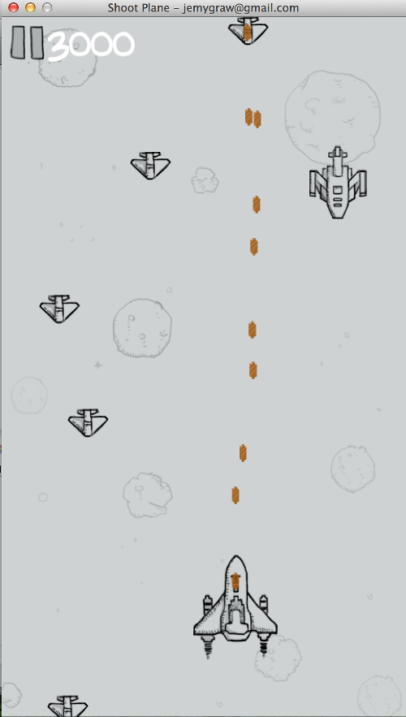

ShootPlane - 仿微信打飞机游戏的java实现
===========================================

##文件夹结构
        images      本项目所用到的图片文件，从微信的apk里面解压出来的，稍微处理了一下 
        sound       本项目所用到的声音文件，从微信的apk里面解压出来的，原来是mp3格式，转成了java可以播放的wav格式 
        src         本项目的源代码
        publish     项目发布时的一些有用的启动脚本
        help.html   本项目的帮助文件
        score.dat   自动生成的用来保存序列化后的最高10个分数的文件

##源码结构
        config      项目的配置类目录
        entity      项目的实体类目录
        factory     项目的武器，子弹，敌机的创建工厂类
        listener    项目的武器，子弹，敌机的位置改变监听接口
        ui          项目的图形界面类
        util        项目的工具类，文件操作，声音播放

##项目发布步骤
        1.导出ShootPlane.jar
        2.将images，sound，help.html，score.dat拷贝到和ShootPlane.jar相同的文件夹里面
        3.（可选）将publish里面的bat脚本拷贝到ShootPlane.jar相同目录里面

##运行程序
        使用启动脚本或者java -jar ShootPlane.jar可以运行程序
	
 
##其余的细节部分，将逐步在项目的WIKI里面发布！谢谢关注，欢迎fork！

##效果图

##赞助开发更多App！[https://me.alipay.com/jemygraw](https://me.alipay.com/jemygraw)